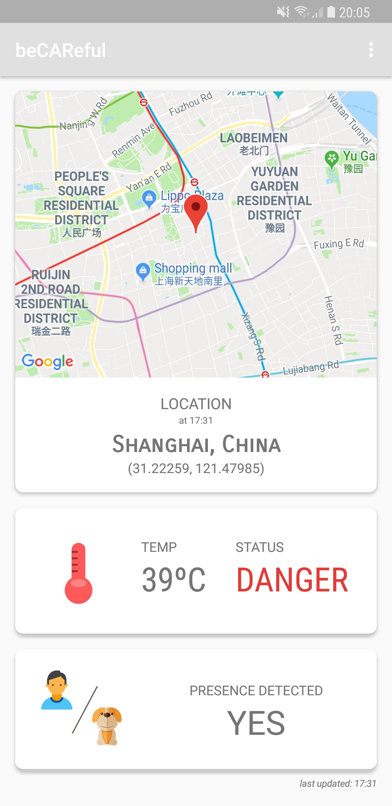

# BeCAReful Android Application

## Project Description

BeCAReful was developed for a multidisciplinary project course in my Bachelor and also for participating in Telefónica's HackForGood hackathon.

The full system tackles the issue of monitoring and acting in case of children or animals are left inside a vehicle in hot environments which could turn fatal in some cases.

For monitoring the sensors installed in the car, an Android app was developed that showed the status of the vehicle with metrics such as location, temperature and detected presence of children or animals.

## Tools Used

- Android SDK (Developed for Android 8.1)
- Maps API
- RabbitMQ
- Google Cloud Platform
- PostgreSQL

